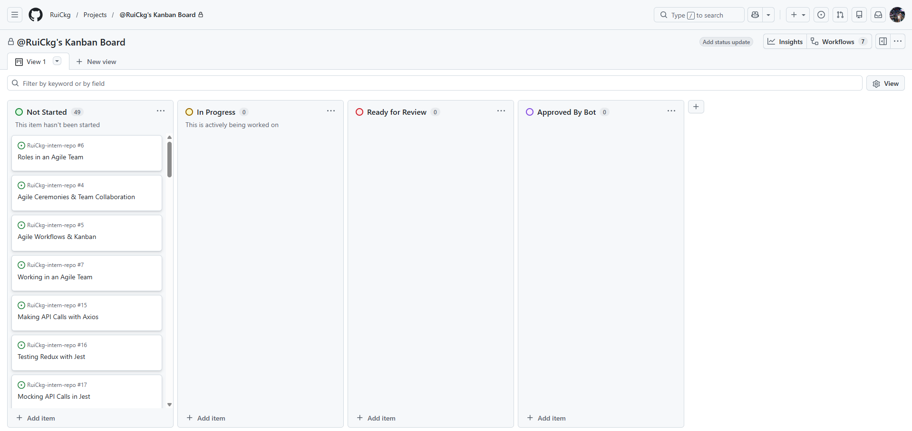
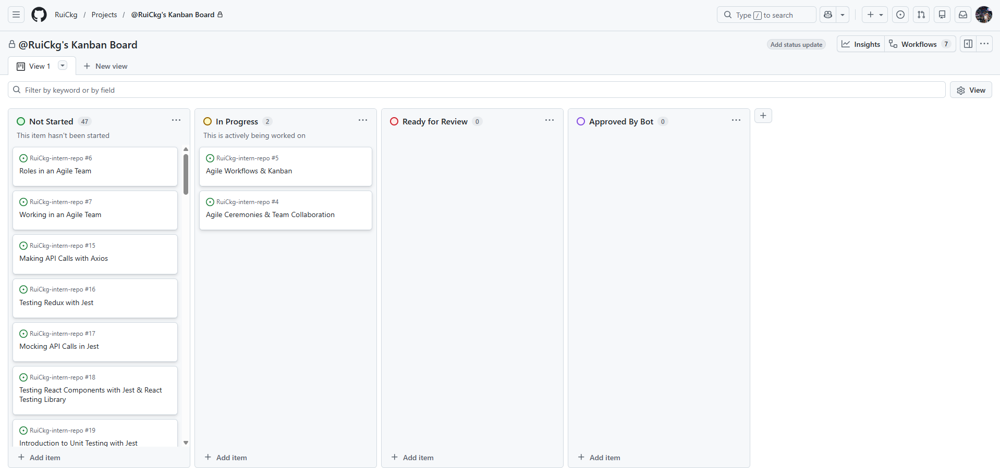

# Agile Workflows & Kanban - Rui Chosa
## Research & Learn
### How does a Kanban board work, and how does it help manage workflow?
Kanban board visualizes work progress using cards to represent work items and columns to represent each stage of the process.
It helps teams to identify bottlenecks and overcommitments, thereby allowing them to optimize the workflow.

### What do the different columns on a Kanban board represent? (e.g., Backlog, In Progress, Blocked, Done)
- *Backlog:* Task that need to be done in the future.
- "To Do:" Tasks ready to start.
- "In Progress:" Tasks currently being worked on.
- "Blocked:" Tasks that can't move forward due to an issue.
- "Done:" Completed tasks.

### How do tasks move through the board, and who is responsible for updating them?
Tasks move left to right depending on their status of work progresses. The person who is assigned to the task has the responsibility for updating them.

### What are the benefits of limiting work in progress (WIP)?
- Team works on fewer tasks at once.
- Tasks get finished quicker instead of half done.
- Less context switching.
- Problems become visible.
- More attention on each task.

## Reflection
### How does Kanban help manage priorities and avoid overload?
Kanban helps manage priorities by clearly showing what should be done next. WIP limits prevent too many tasks from being worked on at once, reducing overload. It also makes bottlenecks visible so teams can fix issues quickly.

### How can you improve your workflow using Kanban principles?
Kanban helps improving workflow by visualising tasks, limiting work in progress to stay focused, and regularly reviewing your board to fix bottlenecks and adjust priorities.

## Task
### Create a kanban board for your repo with relevant columns (e.g. not started, in progress, ready for review, approved by bot)
I created a kanban board for the repo.

### Move at least one task through the Kanban process and update its status correctly.
I moved "Agile Workflows & Kanban" and "Agile Ceremonies & Team Collaboration" from Not Started to In Progress.

### Identify one way you can improve task tracking in your role.
One way I can improve task tracking is using Kanban board consistently. And everytime when the status is changed, remember to move the status from next status so I can track my progress precisely.