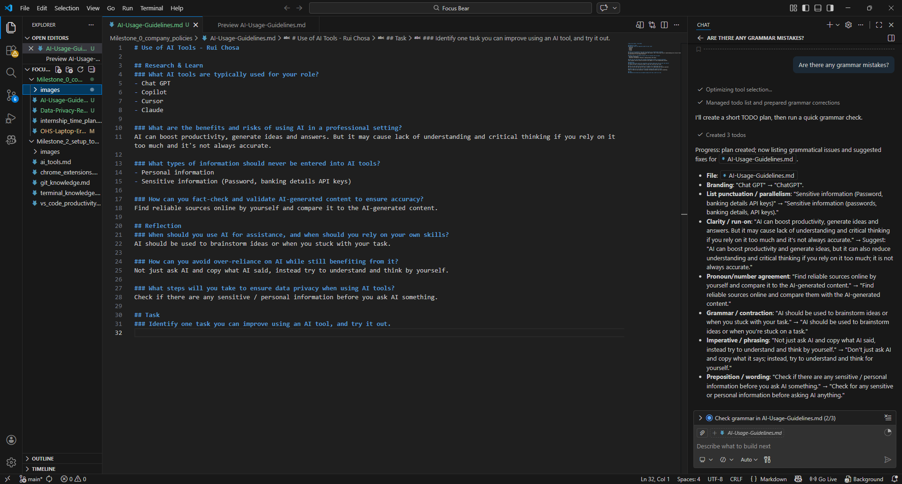

# Use of AI Tools - Rui Chosa

## Research & Learn
### What AI tools are typically used for your role?
- ChatGPT
- Copilot
- Cursor
- Claude

### What are the benefits and risks of using AI in a professional setting?
AI can boost productivity and generate ideas, but it can also reduce understanding and critical thinking if you rely on it too much; it is not always accurate.

### What types of information should never be entered into AI tools?
- Personal information
- Sensitive information (passwords, banking details, API keys)

### How can you fact-check and validate AI-generated content to ensure accuracy?
Find reliable sources online and compare them with the AI-generated content.

## Reflection
### When should you use AI for assistance, and when should you rely on your own skills?
AI should be used to brainstorm ideas or when you're stuck on a task.

### How can you avoid over-reliance on AI while still benefiting from it?
Don't just ask AI and copy what it says; instead, try to understand and think for yourself.

### What steps will you take to ensure data privacy when using AI tools?
Check for any sensitive or personal information before asking AI anything.

## Task
### Identify one task you can improve using an AI tool, and try it out.
I asked Copilot on VS code if there are any grammar mistakes in this file.

### Review the AI-generated output critically—did it require editing or fact-checking?
Since it was just a grammar check, there weren't any problems, and all the suggestions improved my writing.

### Document one best practice you will follow when using AI tools at Focus Bear.
I will never enter any sensitive information.
