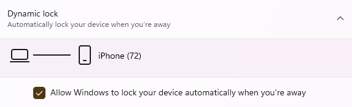

# Cyber Security - Rui Chosa

## Research & Learn
### What are common cyber security threats in a remote work environment?
- Phishing attacks
- Malware and ransomware
- Unsecured Wi-Fi networks
- Weak passwords or reused credentials
- Social engineering

### What are best practices for keeping your devices and accounts secure?
- Keep your operating system and software updated.
- Use strong, unique passwords for every account.
- Enable two-factor authentication (2FA).
- Avoid using public Wi-Fi for sensitive work, or use a VPN.
- Install antivirus and security software.
- Lock your devices when not in use.
- Be cautious when downloading files or clicking links.

### Why is it important to lock your computer when away from your desk?
Locking your computer prevents unauthorized people from accessing sensitive information. Even in a home environment, family members, roommates, or visitors could accidentally or intentionally access confidential data.

### How should you handle phishing attempts and suspicious links?
- Do not click on suspicious links or download unexpected attachments.
- Check the sender’s email address carefully.
- Look for unusual spelling, grammar mistakes, or urgent requests.
- Verify requests for sensitive information through official channels.
- Report suspicious emails to your IT or security team.

### What makes a strong password, and why should you use a password manager?
- Long (12-16 characters)
- Use lower case, upper case, numbers, special characters
- Do not repeat characters
- Do not use common patterns (e.g. 123456)

Password management tools should be used because their password storage and auto-fill features encourage the use of unique passwords for each account. This eliminates the need to remember passwords or struggle to come up with new ones.

### Why is two-factor authentication (2FA) important, and when should you enable it?
Two-factor authentication is crucial because even if someone manages to guess your password, they must still pass through an additional security layer. This is typically achieved through an authentication code sent to your mobile phone, making it nearly impossible to bypass unless you have the phone in your possession. You should always keep it enabled.

## Reflection
### What security measures do you currently follow, and where can you improve?
Currently, I make sure to keep my devices updated and avoid clicking on suspicious links or emails. I also try to use different passwords for important accounts and enable two-factor authentication where possible.

### How can you make secure behaviour a habit rather than an afterthought?
Cybersecurity measures must be treated as part of daily operations, not optional tasks. Examples include locking my computer whenever you leave my desk, double-checking the sender before clicking links in emails, and updating software immediately when updates become available.

### What steps will you take to ensure your passwords and accounts are secure?
I will use a password manager and update my passwords frequently.

### What would you do if you suspected a security breach or suspicious activity on your account?
If I suspect a security breach, immediately change password and enable or reset two-factor authentication. Also log out of all active sessions and review my recent login history.

## Task
### Document one new cyber security habit you will follow at Focus Bear.
Lock my computer whenever I leave.

