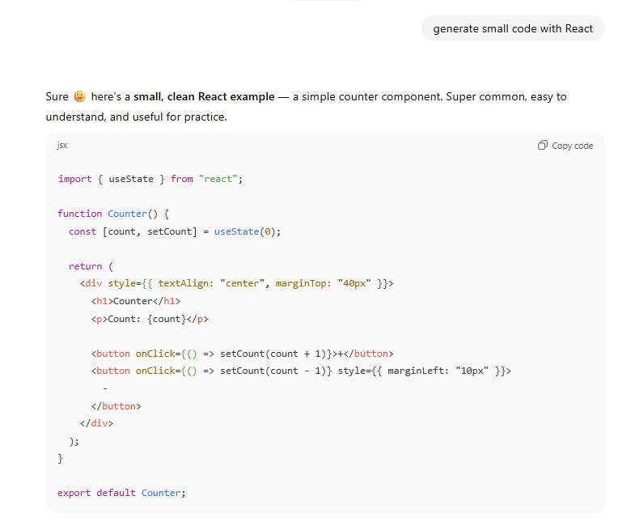
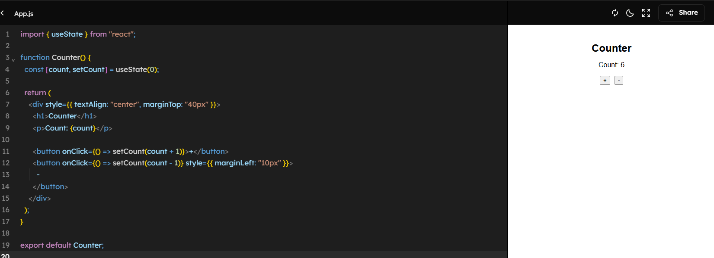
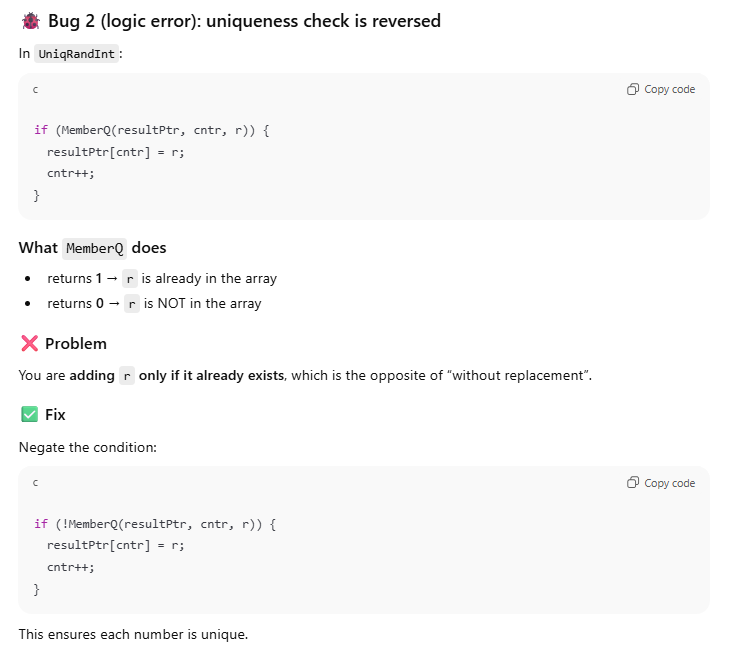
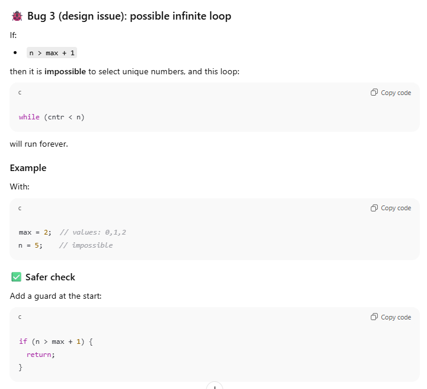

# AI Tools - Rui Chosa

## Whchis AI Tools I used
- ChatGPT

## What worked well? What didn't?
**Worked Well:**
- Generating simple projects

- Finding and debugging bugs

**What didn't:**
I asked AI to generate small projects, everything worked well.
## When I think AI is most useful for coding?
I think AI is useful for brainstorming ideas, fiding and debugging buggs etc. I believe you shouldn't use AI
for generating whole codes and projects since AI can still make mistake and may reduce learning if developers rely on that too much. 