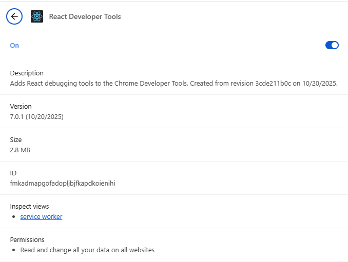
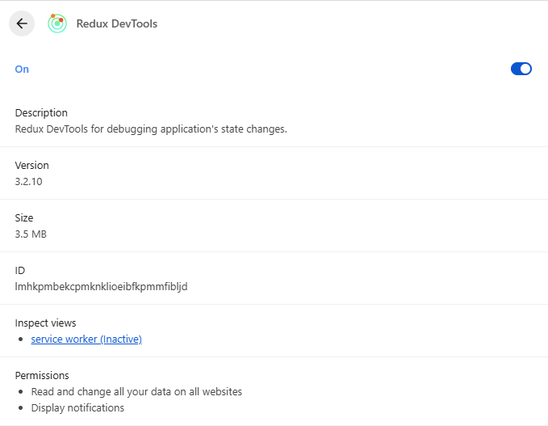
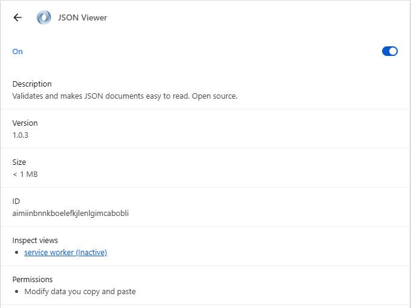
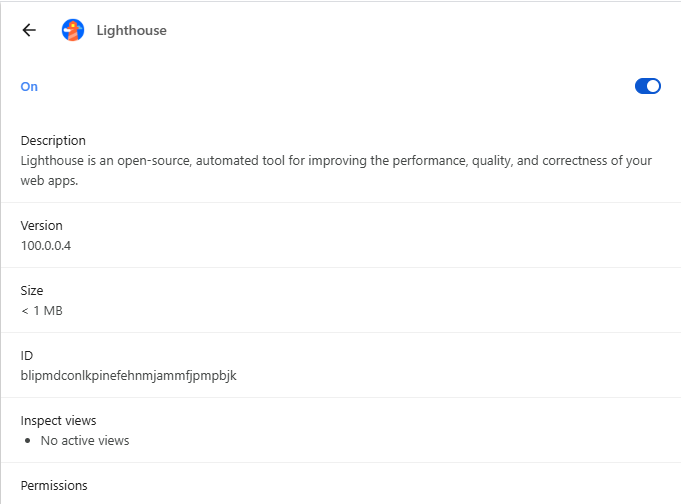
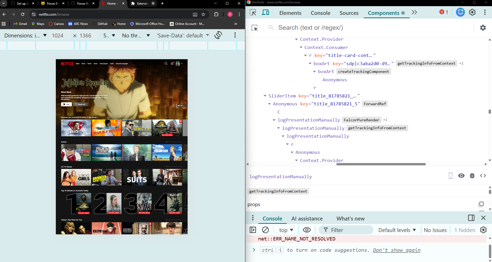

# Set up dev productivity chrome extensions - Rui Chosa

## Which extensions did you install? Why?
- React Developer Tools: It allows you to inspect the React component hierarchies which is useful for debugging.

- Redux DevTools: It allows you to inspect and see the change in states on a page which is useful for debugging.

- JSON Viewer: It allows you to format and display JASON API responses in a reliable, structured view automatically.

- Lighthouse: It's an open-source that test the performance, quality, and correctnessof web applications.

### Demo of React Developer Tools
I used React Developer Tools to see the component of Netflix.

## What was the most useful thing you learned?
I learnt that there are lots of etensions like these. I didn't know any of these extensions that are actually useful before since I didn't get taught through my university courses. 