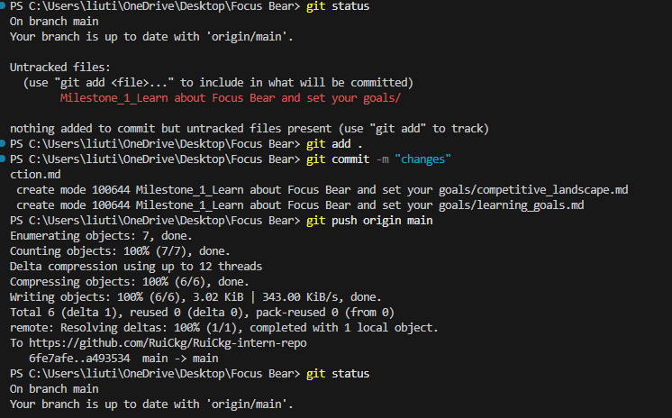

# Set up git locally - Rui Chosa

## Have you used Git before? If so, in what context?
Yes, I have used Git in university, especially in my Object Oriented Programming (COS20007) project where I built a Job Seeker Portal in C#. I used Git to track changes when implementing features like job applications and role-based access. I also used it to revert changes when I accidentally broke parts of my program during refactoring.

## Which Git client (if any) did you choose? Why?
I mainly used the Git CLI. I checked GitHub Desktop and also looked at the built-in Git integration in VS Code. However, I decided to stick with the CLI:
- It gives me a better understanding of how Git actually works.
- It feels more flexible and powerful.
- Many tutorials and documentation use CLI commands.

## What was the most interesting thing you learned about Git today?
I learnt how Git works from local changes to pushing them to GitHub with the following commands:
git add, git commit, and git push.

