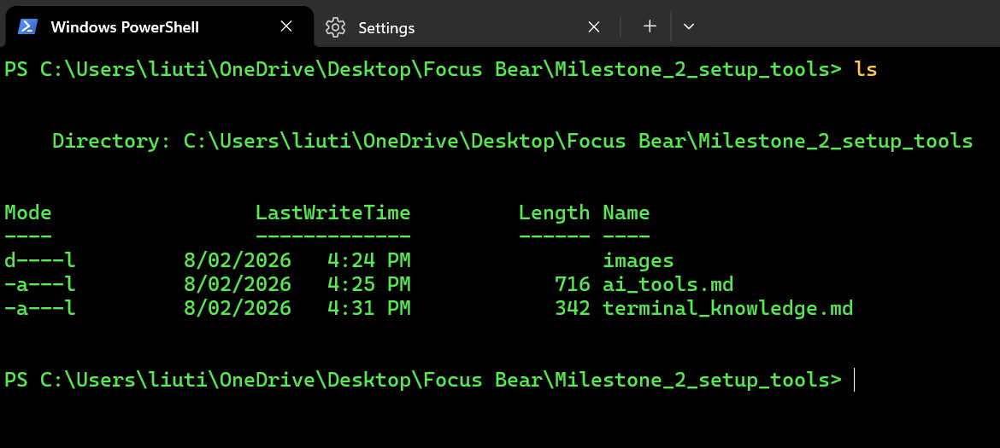
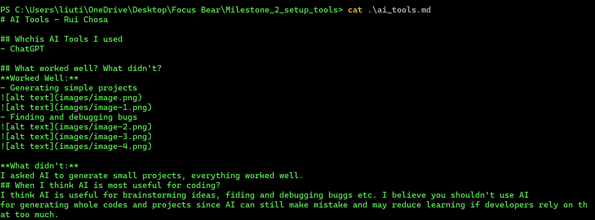

# Set up a terminal client - Rui Chosa

## Which terminal client did you choose? Why?
I chose Windows Powershell because I have used it before through my university courses.

## What customizations (if any) did you make?
I changed color scheme to Ottosson and text color to green.

## What was the most useful command you learned today?
cat: you can see file contents easily without opening the file directly.
