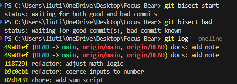
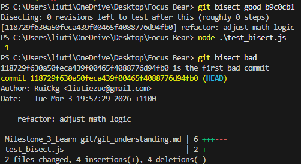

# Learb Git - Rui Chosa

# Pull Requests #47

## Research what a Pull Request (PR) is and why it’s used.

A Pull Request (PR) is a request for team members to know that their code changes are ready to merge into the main codebase. It is used as a dedicated forum for discussing, reviewing, and testing code before it is integrated.

## Why are PRs important in a team workflow?

PRs are important because team members will be working in different branches. It allows us to review and test codes before merging them into main branch whcich will lead to consistency and great quality.

## What makes a well-structured PR?

- A clear and meaningful title
- A detailed description
- Small and focused changes
- Clean commit history
- Professional communication

## What did you learn from reviewing an open-source PR?

I noticed that reviewers focus heavily on clarity and maintainability, even for small changes, which highlights how important code quality is in large open-source projects.

# Writing Meaningful Commit Messages #48

## Research best practices for writing commit messages.

- Limit the subject line to 50 characters
- Capitalize the subject/description line
- Do not end the subject line with a period
- Separate the subject from the body with a blank line
- Wrap the body at 72 characters
- Use the body to explain what and why
- Use the imperative mood in the subject line let it seem like you’re giving a command eg “feat: Add unit tests for user authentication”. Using the imperative mood in commit messages makes them more consistent and commands-like, which is helpful in understanding the actions taken.

## Explore commit histories in an open-source GitHub project (e.g., React, Node.js) and analyze good vs. bad commit messages.

_Good_

- "fix: remove unused variable to fix linter (#35919)": This shows good example action + scope + reason.
- "crypto: fix missing nullptr check on RSA_new()" and "deps: upgrade npm to 11.11.0": This shows clear prefixing by area (doc/tls/tools/crypto/etc.)

_Bad_

- Vague messages like "update", "fix", "stuff", which don’t tell you what changed or why.

## Make three commits in your repo with different commit message styles:

### A vague commit message (e.g., "fixed stuff").

Test line 1
https://github.com/RuiCkg/RuiCkg-intern-repo/commit/663d6f5af014d20859fb674f352b9d4630a5629a

### An overly detailed commit message.

Test line 2
https://github.com/RuiCkg/RuiCkg-intern-repo/commit/ef9dc88ff8b5383464b2d6bf857b4b4aad96d971

### A well-structured commit message.

Test line 3
https://github.com/RuiCkg/RuiCkg-intern-repo/commit/652eaea854b1e74bb3d09b4199d905365052402e

## What makes a good commit message?

As I mentioned in Research best practices for writing commit messages above.

## How does a clear commit message help in team collaboration?

Clear commit messages save time for everyone. Teammates can understand the purpose of a change without opening every diff, which makes reviews, debugging, and handovers easier

## How can poor commit messages cause issues later?

There would be tons of commits you have to look at and if there are poor commits, it can be really hard to find certain commits and keep track of the history of the code.

# Understand git bisect #49

## Research git bisect and how it helps in debugging.

git bisect is a powerful Git command that uses a binary search algorithm to efficiently find the specific commit in a project's history that introduced a bug or unwanted change.

## Create a test scenario:

### Make a series of commits in your test repo.

- commit 1: chore: add sum script
- commit 2: refactor: coerce inputs to number
- commit 3: refactor: adjust math logic
- commit 4: docs: add note
  To test, I used git bisect start, then git bisect bad to mark this current commit as bad, went back and found a commit where there was no bug using git log --oneline and marked it good with git bisect good <commit-hash>.

## What does git bisect do?

git bisect is a powerful Git command that uses a binary search algorithm to efficiently find the specific commit in a project's history that introduced a bug or unwanted change.

## When would you use it in a real-world debugging situation?

In a situation where the issue wasn't immediately caught and the history spans many commits.

## How does it compare to manually reviewing commits?

git bisect is a powerful, automated binary search tool used to find the exact commit that introduced a bug, reducing hundreds of commits to a few tests in logarithmic time (O(log n)
). In contrast, manual review is a linear, time-consuming process that involves checking each commit one by one.

# Advanced Git Commands & When to Use Them

## What does each command do?

git checkout main -- <file> – Restore a specific file from main without affecting other changes.
git cherry-pick <commit> – Apply a specific commit from another branch without merging the whole branch.
git log – View commit history and understand how changes evolved.
git blame <file> – See who last modified each line in a file and when.

## When would you use it in a real project (hint: these are all really important in long running projects with multiple developers)?

I'm definitely going to use checkout a lot, it's perfect for when I go down a rabbit hole and just need to get back to a version that actually works. cherry-pick is a great backup for those times I start coding without checking which branch I’m on. I also like the idea of blame, it'll make it much easier to track down why someone tweaked my code so I can just go ask them about it.

## What surprised you while testing these commands?

The biggest surprises were the precision of single-file restores and the fact that cherry-pick creates an entirely new commit hash rather than moving the original. Additionally, using git log --oneline and git blame with line ranges proved to be the most efficient way to audit history directly from the terminal.

# Merge Conflicts & Conflict Resolution

Merge conflicts in Git occur when the same lines of a file or the same files are modified differently on two separate branches that are being merged, and Git cannot automatically decide which version to keep. Manual intervention is required to resolve these conflicts.
