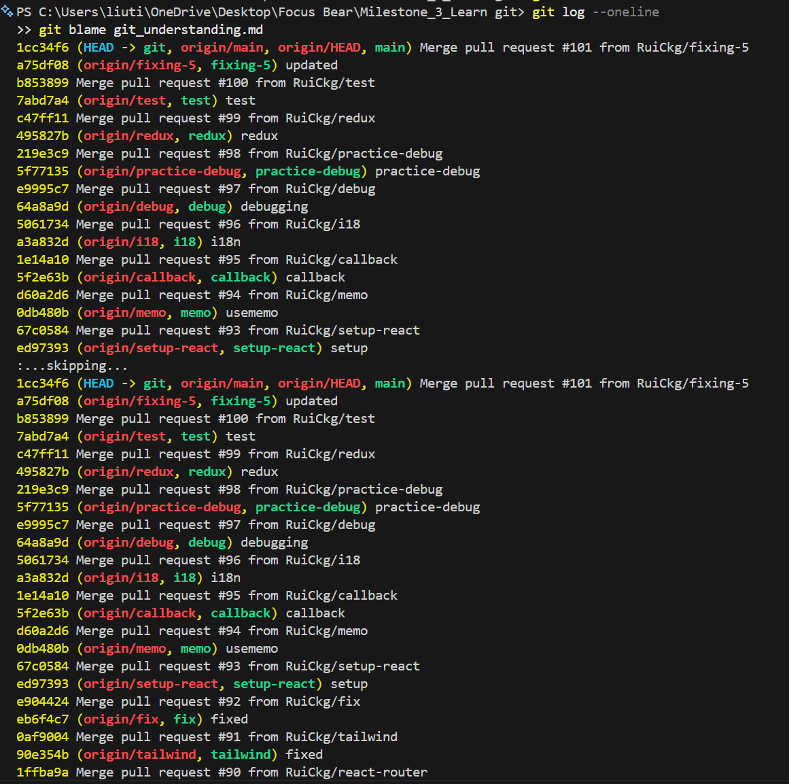
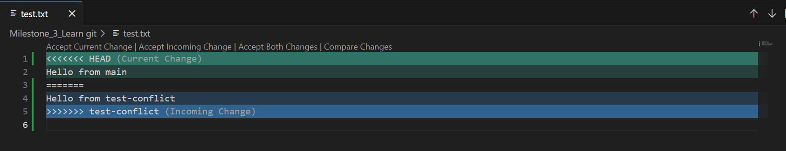
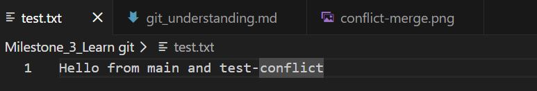
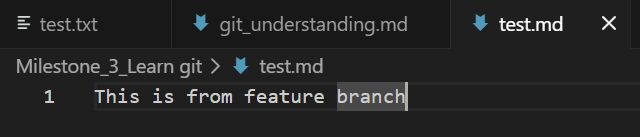
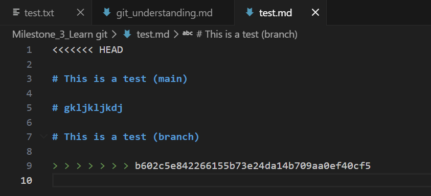

# Learb Git - Rui Chosa

# Pull Requests #47

## Research what a Pull Request (PR) is and why it’s used.

A Pull Request (PR) is a request for team members to know that their code changes are ready to merge into the main codebase. It is used as a dedicated forum for discussing, reviewing, and testing code before it is integrated.

## Why are PRs important in a team workflow?

PRs are important because team members will be working in different branches. It allows us to review and test codes before merging them into main branch whcich will lead to consistency and great quality.

## What makes a well-structured PR?

- A clear and meaningful title
- A detailed description
- Small and focused changes
- Clean commit history
- Professional communication

## What did you learn from reviewing an open-source PR?

I noticed that reviewers focus heavily on clarity and maintainability, even for small changes, which highlights how important code quality is in large open-source projects.

# Writing Meaningful Commit Messages #48

## Research best practices for writing commit messages.

- Limit the subject line to 50 characters
- Capitalize the subject/description line
- Do not end the subject line with a period
- Separate the subject from the body with a blank line
- Wrap the body at 72 characters
- Use the body to explain what and why
- Use the imperative mood in the subject line let it seem like you’re giving a command eg “feat: Add unit tests for user authentication”. Using the imperative mood in commit messages makes them more consistent and commands-like, which is helpful in understanding the actions taken.

## Explore commit histories in an open-source GitHub project (e.g., React, Node.js) and analyze good vs. bad commit messages.

_Good_

- "fix: remove unused variable to fix linter (#35919)": This shows good example action + scope + reason.
- "crypto: fix missing nullptr check on RSA_new()" and "deps: upgrade npm to 11.11.0": This shows clear prefixing by area (doc/tls/tools/crypto/etc.)

_Bad_

- Vague messages like "update", "fix", "stuff", which don’t tell you what changed or why.

## Make three commits in your repo with different commit message styles:

### A vague commit message (e.g., "fixed stuff").

Test line 1
https://github.com/RuiCkg/RuiCkg-intern-repo/commit/663d6f5af014d20859fb674f352b9d4630a5629a

### An overly detailed commit message.

Test line 2
https://github.com/RuiCkg/RuiCkg-intern-repo/commit/ef9dc88ff8b5383464b2d6bf857b4b4aad96d971

### A well-structured commit message.

Test line 3
https://github.com/RuiCkg/RuiCkg-intern-repo/commit/652eaea854b1e74bb3d09b4199d905365052402e

## What makes a good commit message?

As I mentioned in Research best practices for writing commit messages above.

## How does a clear commit message help in team collaboration?

Clear commit messages save time for everyone. Teammates can understand the purpose of a change without opening every diff, which makes reviews, debugging, and handovers easier

## How can poor commit messages cause issues later?

There would be tons of commits you have to look at and if there are poor commits, it can be really hard to find certain commits and keep track of the history of the code.

# Understand git bisect #49

## Research git bisect and how it helps in debugging.

git bisect is a powerful Git command that uses a binary search algorithm to efficiently find the specific commit in a project's history that introduced a bug or unwanted change.

## Create a test scenario:

### Make a series of commits in your test repo.

- commit 1: chore: add sum script
- commit 2: refactor: coerce inputs to number
- commit 3: refactor: adjust math logic
- commit 4: docs: add note
  To test, I used git bisect start, then git bisect bad to mark this current commit as bad, went back and found a commit where there was no bug using git log --oneline and marked it good with git bisect good <commit-hash>.

## What does git bisect do?

git bisect is a powerful Git command that uses a binary search algorithm to efficiently find the specific commit in a project's history that introduced a bug or unwanted change.

## When would you use it in a real-world debugging situation?

In a situation where the issue wasn't immediately caught and the history spans many commits.

## How does it compare to manually reviewing commits?

git bisect is a powerful, automated binary search tool used to find the exact commit that introduced a bug, reducing hundreds of commits to a few tests in logarithmic time (O(log n)
). In contrast, manual review is a linear, time-consuming process that involves checking each commit one by one.

# Advanced Git Commands 

## git checkout main -- <file>

I modified a file in my project and then ran:
git checkout main -- test.txt

This restored the file back to the version from the main branch. I noticed that my changes were completely removed, and `git status` no longer showed the file as modified.

This command is useful when I want to discard changes in a specific file without affecting other files.

## git cherry-pick <commit>

I created a new branch and made a commit there. Then I switched back to main and ran:
git cherry-pick <commit-hash>

This applied that specific commit to the main branch. I saw a new commit added in `git log` with the same message but a different commit hash.

This is useful when I want to move a specific feature or fix without merging the whole branch.

## git log

I ran:
git log

This showed a list of commits with commit hashes, author names, and timestamps. I could clearly see my recent commit messages and track what changes I made.

This is useful for understanding the history of the project and debugging issues.

## git blame <file>

I ran:
git blame test.txt

This showed each line of the file along with the commit hash and author who last modified it. I could see exactly which part of the file I changed and when.

This is useful when working in a team to identify who made specific changes.

## What surprised me

I was surprised that `git cherry-pick` creates a new commit instead of copying the original commit exactly. Also, `git blame` was very detailed and showed line-by-line history, which I didn’t expect.

# Git Concepts: Staging vs. Committing 

## What is the difference between staging and committing?

Staging means preparing changes for the next commit. It lets me choose which files or changes I want to include before saving them.

Committing means saving the staged changes into Git history as a snapshot. Once I commit, the changes are recorded in the repository.

## Why does Git separate these two steps?

Git separates staging and committing so developers can control exactly what goes into each commit. This helps keep commits clean and organised.

For example, if I change two files but only want to save one of them first, I can stage only that file and commit it.

## When would you want to stage changes without committing?

I would stage changes without committing when I want to check my work first, review which files are included, or prepare only part of my work for a commit.

This is useful when I have made multiple changes but want to create smaller and clearer commits.

## My experiment

I modified a file in my repository and checked the status with `git status`. Git showed the file as modified.

Then I used `git add <file>` to stage it. After that, `git status` showed the file in the staging area.

Next, I used `git reset HEAD <file>` to unstage it. Git then showed it as modified again, but not staged.

Finally, I staged the file again and committed it with `git commit -m "Test staging vs committing"`. This showed me that staging only prepares changes, while committing actually saves them in Git history.

## Merge Conflicts & Conflict Resolution

### What caused the conflict?

I created a new branch called `conflict-test` and edited the same file (`test.txt`). Then I switched back to main and edited the same line differently.

When I ran `git merge conflict-test`, Git showed this message:
CONFLICT (content): Merge conflict in test.txt

This happened because both branches modified the same part of the file.

---

### How did you resolve it?

I opened the file and saw conflict markers:

I manually edited the file and combined both changes into:
Hello from main and test-conflict

Then I ran:
git add test.txt  
git commit -m "Resolved conflict"

After that, the merge was completed successfully.

---

### What did you learn?

I learned that merge conflicts happen when the same part of a file is changed in different branches.

Git cannot decide which change is correct, so I need to manually fix it.

This experience helped me understand how important it is to manage branches carefully and communicate with team members to avoid conflicts.

## Branching & Team Collaboration

### Why is pushing directly to main problematic?

When I created a new branch (`feature-test`) and made a change, I noticed that the change only existed in that branch.

When I switched back to main using `git checkout main`, the change was not there.

This showed me that if I push directly to main, it can affect the main project immediately without testing. This is risky because it can break the project for everyone.

---

### How do branches help with reviewing code?

Branches allow me to work on features separately without affecting the main branch.

For example, I made a change in `feature-test`, and it stayed isolated from main. This means I can create a pull request and let others review my code before merging.

Branch:

Main:

This helps improve code quality and catch mistakes before they affect the main project.

---

### What happens if two people edit the same file on different branches?

If two people edit the same file in different branches, Git will try to merge the changes.

If they edit different parts, Git merges automatically. But if they edit the same line, a merge conflict occurs.

I experienced this in the previous task, where Git asked me to manually resolve the conflict.

---

### What I observed

After switching back to main, I confirmed that my changes from the branch were not visible.

This helped me understand how branches isolate work and protect the main branch.