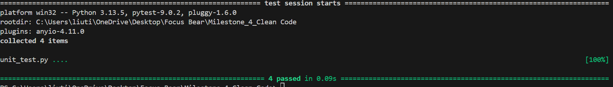

# Understanding Clean Code Principles

## Research and summarize the following clean code principles
Simplicity
- Keep code as simple as possible.
- Makes it easier to understand, debug and maintain

Readability
- Code should be easy to read and understand.
- Improves collaboration and reduces mistakes

Maintainability 
- Code be easy to extend and modify in the future
- Ensures long term project growth and reduces technical debt

Consistency 
- Follow established standards and conventions
- Consistent code is easier to maintain and understand

Efficiency
- Code should be optimized as much as possible and not be complicated
- Ensures better performance and resource usage

## Find an example of messy code online (or write one yourself) and describe why it's difficult to read.
Generated by ChatGPT

Code:
```
a=10
b=5
c=0
if a>5:
 if b<10:
  c=a+b
  print(c)
```

Why:
- Poor formatting / indentation
- No spacing between operators
- Hard to maintain

## Rewrite the code in a cleaner, more structured way.
```
a = 10
b = 5

if a > 5 and b < 10:
    c = a + b
    print(c)
```

# Handling Errors & Edge Cases - Rui Chosa

## 🔍 What was the issue with the original code?

The original code did not handle errors or edge cases properly. It assumed that all inputs were valid and did not check for incorrect or unexpected values.

For example, dividing by zero or passing non-numeric values could lead to unexpected results such as `Infinity` or `NaN`. This makes the code unreliable and difficult to debug.

---

## Example of messy code

```javascript
function divide(a, b) {
  return a / b;
}

console.log(divide(10, 0));
```

### Issues:

* No input validation
* No handling for division by zero
* Can return unexpected values like `Infinity`
* Not safe for real-world use

---

## Refactored code (Improved version)

```javascript
function divide(a, b) {
  // Validate input types
  if (typeof a !== "number" || typeof b !== "number") {
    console.error("Invalid input: both values must be numbers");
    return null;
  }

  // Handle edge case: division by zero
  if (b === 0) {
    console.error("Cannot divide by zero");
    return null;
  }

  return a / b;
}

console.log(divide(10, 0));
```

---

## How does handling errors improve reliability?

Handling errors improves reliability by ensuring the program behaves predictably even when unexpected inputs are provided.

Key benefits include:

* Prevents crashes and unexpected behavior
* Makes debugging easier
* Improves user experience with clear error messages
* Ensures the program handles edge cases safely

# Unit Testing

### Research the importance of unit testing in software development.

* **Finds bugs early**

  * Helps detect issues before they become bigger problems in the application.

* **Improves reliability**

  * Ensures functions work correctly for both normal and edge cases.

* **Encourages clean code**

  * Developers write smaller, simpler, and more focused functions that are easier to test.

* **Supports safe refactoring**

  * Code can be improved or changed without breaking functionality because tests verify behaviour.

* **Saves time**

  * Fixing bugs early is faster than debugging complex systems later.

---

### Choose a testing framework.

* **Framework chosen: PyTest**

  * PyTest is simple, readable, and widely used for Python testing.
  * It allows writing clean and easy-to-understand test cases.

---

### Function to test

```python
def divide_numbers(a, b):
    if not isinstance(a, (int, float)) or not isinstance(b, (int, float)):
        return None

    if b == 0:
        return None

    return a / b
```

---

### Unit tests for the function

```python
from your_file_name import divide_numbers


def test_divide_numbers_normal():
    assert divide_numbers(10, 2) == 5


def test_divide_numbers_zero():
    assert divide_numbers(10, 0) is None


def test_divide_numbers_invalid_input():
    assert divide_numbers("a", 2) is None


def test_divide_numbers_float():
    assert divide_numbers(7.5, 2.5) == 3
```

---

### How do unit tests help keep code clean?

Unit tests help keep code clean by encouraging developers to write small, simple, and focused functions. Code that is easy to test is usually easier to read and maintain. Unit tests also help ensure that the code behaves correctly, which reduces bugs and improves overall quality.

---

### What issues did you find while testing?

While testing, I found that the function needed to properly handle edge cases such as division by zero and invalid input types. Without these checks, the function could return unexpected results or fail. Writing unit tests helped identify these problems and improve the reliability of the function.
