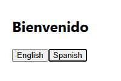

# i18n Reflection

## Challenges faced

One challenge I faced was understanding how to configure i18next and structure translation resources properly. It was also initially confusing how to connect i18n configuration with React components.

## Why use i18next instead of manual translation?

Using i18next allows developers to manage translations in a structured and scalable way. It avoids hardcoding strings and makes it easy to support multiple languages. It also provides features like language switching and fallback handling.

## Handling dynamic content

Dynamic content such as user-generated text should not be translated directly. Instead, static UI text should use i18next, while dynamic data should be handled separately or translated using external services if needed.

```js (i18n.js)
import i18n from "i18next";
import { initReactI18next } from "react-i18next";

i18n.use(initReactI18next).init({
  resources: {
    en: {
      translation: {
        welcome: "Welcome",
      },
    },
    es: {
      translation: {
        welcome: "Bienvenido",
      },
    },
  },
  lng: "en",
  fallbackLng: "en",
  interpolation: {
    escapeValue: false,
  },
});

export default i18n;
```

```js (i18nExample.js)
import { useTranslation } from "react-i18next";

function I18nExample() {
  const { t, i18n } = useTranslation();

  return (
    <div style={{ padding: "20px" }}>
      <h2>{t("welcome")}</h2>

      <button onClick={() => i18n.changeLanguage("en")}>
        English
      </button>

      <button onClick={() => i18n.changeLanguage("es")}>
        Spanish
      </button>
    </div>
  );
}

export default I18nExample;
```
