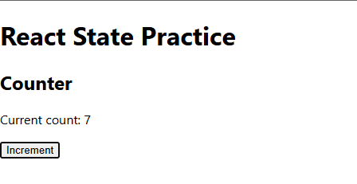
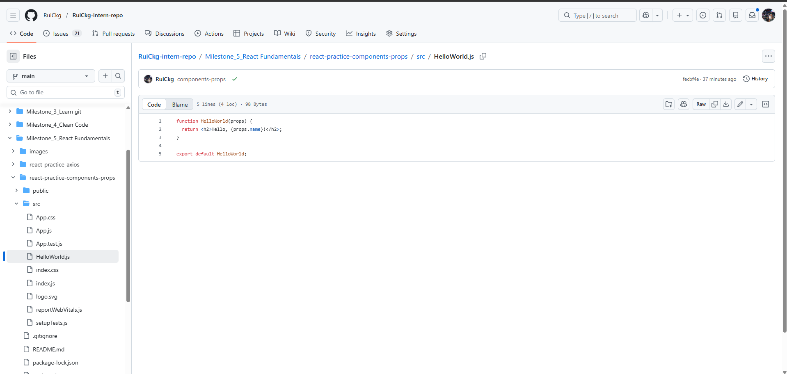
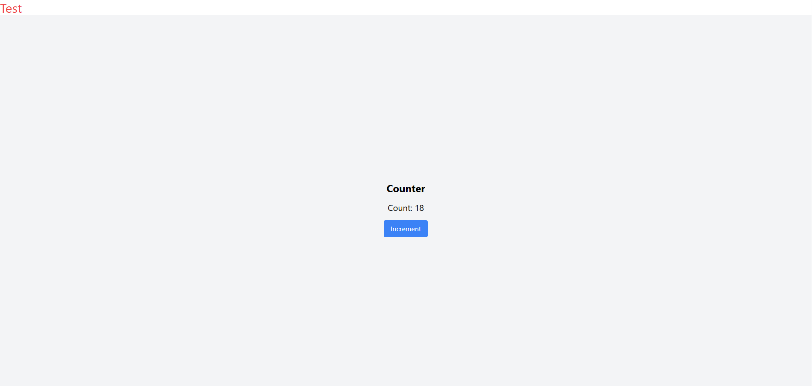

## Handling State & User Input Reflection

In this task, I created a simple counter component using React's `useState` hook. The counter increased by 1 each time the button was clicked, and the updated value was displayed immediately on the page.

Counter.js:

``` 
import { useState } from "react";

function Counter() {
  const [count, setCount] = useState(0);

  const handleIncrement = () => {
    setCount(count + 1);
  };

  return (
    <div>
      <h2>Counter</h2>
      <p>Current count: {count}</p>
      <button onClick={handleIncrement}>Increment</button>
    </div>
  );
}

export default Counter;

```

App.js:
```
import Counter from "./Counter";

function App() {
  return (
    <div>
      <h1>React State Practice</h1>
      <Counter />
    </div>
  );
}

export default App;

```



If we modify state directly instead of using `setState` or the setter function from `useState`, React may not detect the change properly. As a result, the component might not re-render, and the UI may not update as expected.

This task helped me understand that state in React should always be updated using the provided setter function so that React can manage re-rendering correctly.

## Working with Lists & User Input Reflection

When working with lists in React, one common issue is using incorrect keys when rendering items. Using indexes as keys can cause problems when items are added or removed, leading to incorrect UI updates.

Another issue is directly mutating state, such as using array methods like push. Instead, we should create a new array using the spread operator to ensure React detects changes and re-renders properly.

Additionally, forgetting to handle empty input can lead to unwanted blank items in the list.

## Implementation Evidence

### Code Snippet (ListExample.js)

```jsx
const [input, setInput] = useState("");
const [items, setItems] = useState([]);

const handleAddItem = () => {
  if (input.trim() === "") return;
  setItems([...items, input]);
  setInput("");
};

```

## Components & Props Reflection

Components are important in React because they allow developers to break the UI into reusable and independent pieces. This makes the code easier to manage, maintain, and scale.

Props allow data to be passed from one component to another, making components dynamic and reusable. By using props, the same component can display different data without rewriting code.

## Implementation Evidence

### Code Snippet (HelloWorld.js)

```jsx
function HelloWorld({ name }) {
  return <h2>Hello, {name}!</h2>;
}
```



## Navigation with React Router Reflection

Client-side routing allows a React application to switch between pages without reloading the entire browser page. This creates a faster and smoother user experience.

One major advantage is improved performance because only the necessary components are updated instead of requesting a completely new page from the server. It also helps developers build more interactive single-page applications with a cleaner navigation flow.

## Tailwind CSS Reflection

Tailwind CSS allows developers to style components quickly using utility classes directly in the markup. This reduces the need for writing separate CSS files and helps maintain consistency across the project.

One advantage is faster development and easier customization. Developers can quickly adjust spacing, colors, and layout without switching between files.

However, one potential drawback is that class names can become long and harder to read. It may also be challenging for beginners to remember all utility classes.

