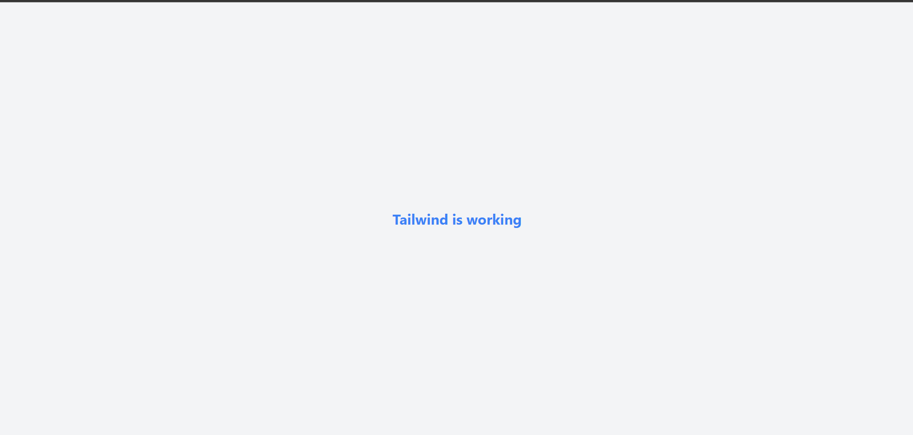

## Handling State & User Input Reflection

In this task, I created a simple counter component using React's `useState` hook. The counter increased by 1 each time the button was clicked, and the updated value was displayed immediately on the page.

Counter.js:

``` 
import { useState } from "react";

function Counter() {
  const [count, setCount] = useState(0);

  const handleIncrement = () => {
    setCount(count + 1);
  };

  return (
    <div>
      <h2>Counter</h2>
      <p>Current count: {count}</p>
      <button onClick={handleIncrement}>Increment</button>
    </div>
  );
}

export default Counter;

```

App.js:
```
import Counter from "./Counter";

function App() {
  return (
    <div>
      <h1>React State Practice</h1>
      <Counter />
    </div>
  );
}

export default App;

```


If we modify state directly instead of using `setState` or the setter function from `useState`, React may not detect the change properly. As a result, the component might not re-render, and the UI may not update as expected.

This task helped me understand that state in React should always be updated using the provided setter function so that React can manage re-rendering correctly.

## Working with Lists & User Input Reflection

When working with lists in React, one common issue is using incorrect keys when rendering items. Using indexes as keys can cause problems when items are added or removed, leading to incorrect UI updates.

Another issue is directly mutating state, such as using array methods like push. Instead, we should create a new array using the spread operator to ensure React detects changes and re-renders properly.

Additionally, forgetting to handle empty input can lead to unwanted blank items in the list.

## Implementation Evidence

### Code Snippet (ListExample.js)

```jsx
const [input, setInput] = useState("");
const [items, setItems] = useState([]);

const handleAddItem = () => {
  if (input.trim() === "") return;
  setItems([...items, input]);
  setInput("");
};

```

## Components & Props Reflection

Components are important in React because they allow developers to break the UI into reusable and independent pieces. This makes the code easier to manage, maintain, and scale.

Props allow data to be passed from one component to another, making components dynamic and reusable. By using props, the same component can display different data without rewriting code.

## Implementation Evidence

### Code Snippet (HelloWorld.js)

```jsx
function HelloWorld({ name }) {
  return <h2>Hello, {name}!</h2>;
}
```


## Navigation with React Router Reflection

Client-side routing allows a React application to switch between pages without reloading the entire browser page. This creates a faster and smoother user experience.

One major advantage is improved performance because only the necessary components are updated instead of requesting a completely new page from the server. It also helps developers build more interactive single-page applications with a cleaner navigation flow.

## Tailwind CSS Reflection

Tailwind CSS allows developers to style components quickly using utility classes directly in the markup. This reduces the need for writing separate CSS files and helps maintain consistency across the project.

One advantage is faster development and easier customization. Developers can quickly adjust spacing, colors, and layout without switching between files.

However, one potential drawback is that class names can become long and harder to read. It may also be challenging for beginners to remember all utility classes.

### Counter.js (Tailwind version)

```jsx
function Counter() {
  const [count, setCount] = useState(0);

  return (
    <div className="flex flex-col items-center justify-center h-screen bg-gray-100">
      <h2 className="text-2xl font-bold mb-4">Counter</h2>

      <p className="text-xl mb-4">Count: {count}</p>

      <button
        onClick={() => setCount(count + 1)}
        className="px-4 py-2 bg-blue-500 text-white rounded hover:bg-blue-600 active:bg-blue-700 transition"
      >
        Increment
      </button>
    </div>
  );
}
```

### Button.js (Reusable Tailwind component)

```jsx
function Button({ text, onClick }) {
  return (
    <button
      onClick={onClick}
      className="px-4 py-2 bg-green-500 text-white rounded hover:bg-green-600 active:bg-green-700 transition"
    >
      {text}
    </button>
  );
}
```

In this task, I applied Tailwind CSS directly in my React components such as Counter.js and Button.js. I used utility classes like `flex`, `items-center`, and `justify-center` to center the layout, and classes like `bg-blue-500`, `text-white`, and `rounded` to style the button.

I found Tailwind very efficient because I could quickly style components without writing separate CSS files. It made development faster and easier to adjust styles directly in JSX.

However, I also found that class names can become long and slightly harder to read, especially when combining many utilities. Additionally, I initially faced issues with Tailwind setup due to version compatibility, which required troubleshooting.

Overall, Tailwind improved my workflow once it was set up correctly.


---

## Environment Setup Reflection

During this setup task, I faced a few challenges while creating and running the React project.

- At first, I tried running commands like `npm run dev`, but my project did not have that script, so I learned that Create React App uses `npm start` instead.
- I was also confused about which folder I should run the commands in. I initially ran commands in the wrong folder, which caused errors.
- Another challenge was setting up Tailwind CSS. I ran into version and PostCSS-related issues, and Tailwind did not work at first.
- I learned that the latest Tailwind setup was not compatible with my Create React App configuration, so I had to use a compatible version and configure the files correctly.
- After fixing the setup, I tested the app in the browser and confirmed that the Tailwind classes were applied correctly.

This task helped me understand that environment setup is not just about following steps. It is also important to check the project structure, use the correct commands, and troubleshoot version compatibility issues.

```js (App.js)
function App() {
  return (
    <div className="flex items-center justify-center h-screen bg-gray-100">
      <h1 className="text-3xl font-bold text-blue-500">
        Tailwind is working 
      </h1>
    </div>
  );
}

export default App;
```

```md (READEME.md)
# React + Tailwind Setup

## Steps to set up the project

1. Create a React app
```bash
npx create-react-app react-state-setup
cd react-state-setup
```
2. Install Tailwind CSS
```bash
npm install -D tailwindcss@3.4.17 postcss autoprefixer
npx tailwindcss init -p
```

3. Configure Tailwind
Update tailwind.config.js:
```js
module.exports = {
  content: ["./src/**/*.{js,jsx,ts,tsx}"],
  theme: {
    extend: {},
  },
  plugins: [],
};
```

4. Add Tailwind to CSS
Update src/index.css:
```css
@tailwind base;
@tailwind components;
@tailwind utilities;
```

5. Run the project
```bash
npm start
```





