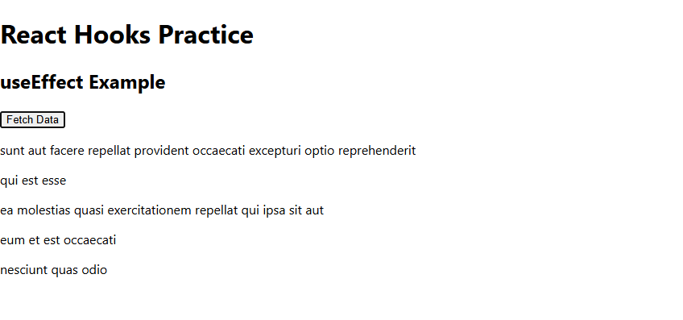

## useEffect Reflection

useEffect is used when we need to run side effects such as fetching data, logging, or interacting with external systems after a component renders.

### When should you use useEffect instead of handling logic inside event handlers?

We should use useEffect instead of event handlers when the logic depends on component lifecycle rather than user actions.

### What happens if you don’t provide a dependency array?

If we don’t provide a dependency array, the effect runs on every render, which can cause performance issues or repeated API calls.

### How can improper use of useEffect cause performance issues?

Improper use of useEffect, such as missing dependencies or unnecessary effects, can lead to infinite loops, slow performance, and unexpected behavior.

## Implementation Evidence

### Code Snippet

```jsx
useEffect(() => {
  console.log("Component mounted");

  return () => {
    console.log("Component unmounted");
  };
}, []);
```

### GitHub Reference
[EffectExample.js](https://github.com/RuiCkg/RuiCkg-intern-repo/blob/main/Milestone_5_React%20Fundamentals/react-practice-effect/src/EffectExample.js)

