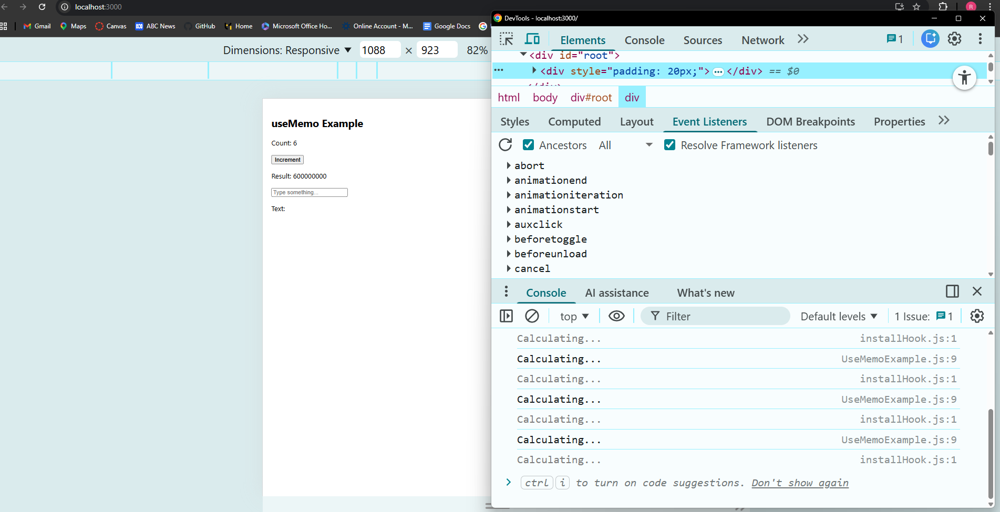
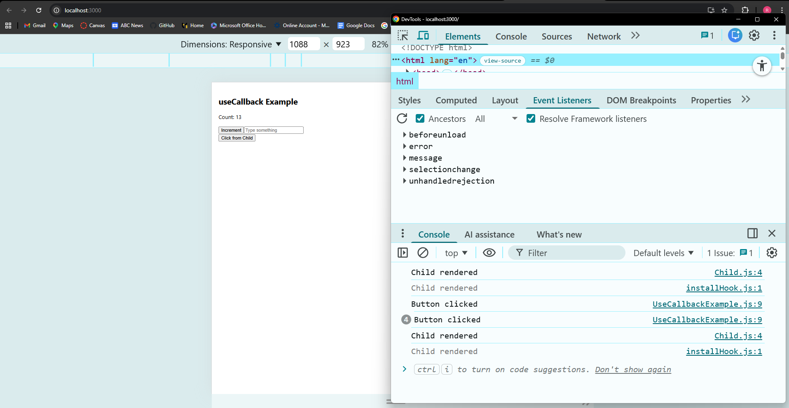

## useEffect Reflection

useEffect is used when we need to run side effects such as fetching data, logging, or interacting with external systems after a component renders.

### When should you use useEffect instead of handling logic inside event handlers?

We should use useEffect instead of event handlers when the logic depends on component lifecycle rather than user actions.

### What happens if you don’t provide a dependency array?

If we don’t provide a dependency array, the effect runs on every render, which can cause performance issues or repeated API calls.

### How can improper use of useEffect cause performance issues?

Improper use of useEffect, such as missing dependencies or unnecessary effects, can lead to infinite loops, slow performance, and unexpected behavior.

## Implementation Evidence

### Code Snippet

```jsx
useEffect(() => {
  console.log("Component mounted");

  return () => {
    console.log("Component unmounted");
  };
}, []);
```

### GitHub Reference
[EffectExample.js](https://github.com/RuiCkg/RuiCkg-intern-repo/blob/main/Milestone_5_React%20Fundamentals/react-practice-effect/src/EffectExample.js)


## useMemo Reflection

useMemo is used to optimize performance by memoizing the result of expensive calculations. It prevents unnecessary recalculations when the component re-renders.

In this task, I used useMemo to cache the result of a heavy computation based on the count value. This ensured that the calculation only ran when the count changed, and not when other state values like input text changed.

This improves performance, especially in components with expensive operations.

```js (UseMemoExample.js)
import { useState, useMemo } from "react";

function UseMemoExample() {
  const [count, setCount] = useState(0);
  const [text, setText] = useState("");

  // Expensive function
  const expensiveCalculation = (num) => {
    console.log("Calculating...");
    let result = 0;
    for (let i = 0; i < 100000000; i++) {
      result += num;
    }
    return result;
  };

  const memoizedValue = useMemo(() => {
    return expensiveCalculation(count);
  }, [count]);

  return (
    <div style={{ padding: "20px" }}>
      <h2>useMemo Example</h2>

      <p>Count: {count}</p>
      <button onClick={() => setCount(count + 1)}>Increment</button>

      <p>Result: {memoizedValue}</p>

      <input
        type="text"
        placeholder="Type something..."
        onChange={(e) => setText(e.target.value)}
      />
      <p>Text: {text}</p>
    </div>
  );
}

export default UseMemoExample;
```



## useCallback Reflection

useCallback is used to memoize functions so that they are not recreated on every render. This helps prevent unnecessary re-renders, especially when passing functions as props to child components.

In this task, I passed a function to a child component and used React.memo to observe re-render behavior. By using useCallback, the function reference remained stable, preventing the child component from re-rendering when unrelated state changed.

Unlike useMemo, which memoizes values, useCallback memoizes functions.

useCallback is not always necessary and should be used when performance optimization is needed, especially in components with frequent re-renders.

```js (Child.js)
import React from "react";

const Child = ({ onClick }) => {
  console.log("Child rendered");

  return (
    <div>
      <button onClick={onClick}>Click from Child</button>
    </div>
  );
};

export default React.memo(Child);
```

```js (UseCallbackExample.js)
import { useState, useCallback } from "react";
import Child from "./Child";

function UseCallbackExample() {
  const [count, setCount] = useState(0);
  const [text, setText] = useState("");

  const handleClick = useCallback(() => {
    console.log("Button clicked");
  }, []);

  return (
    <div style={{ padding: "20px" }}>
      <h2>useCallback Example</h2>

      <p>Count: {count}</p>
      <button onClick={() => setCount(count + 1)}>Increment</button>

      <input
        type="text"
        placeholder="Type something"
        onChange={(e) => setText(e.target.value)}
      />

      <Child onClick={handleClick} />
    </div>
  );
}

export default UseCallbackExample;
```
