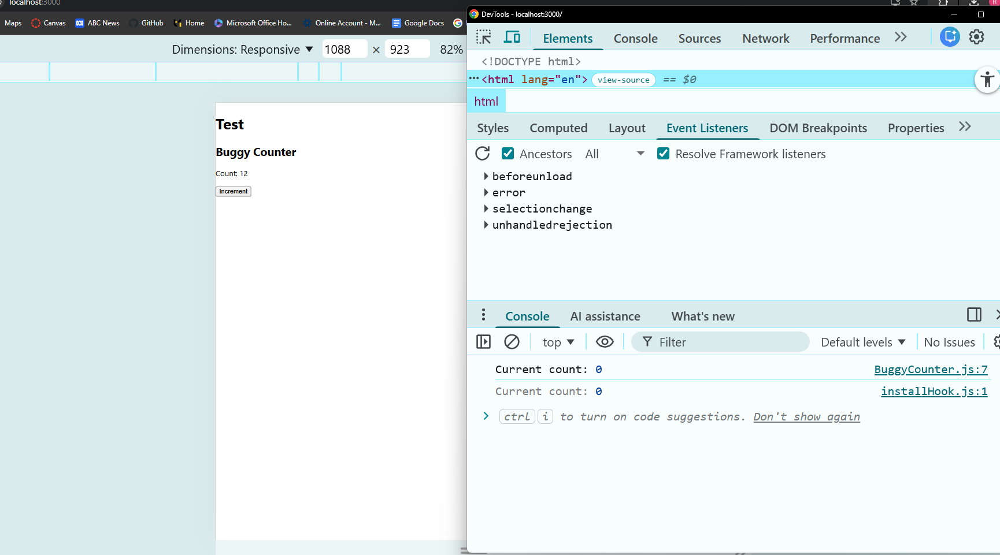
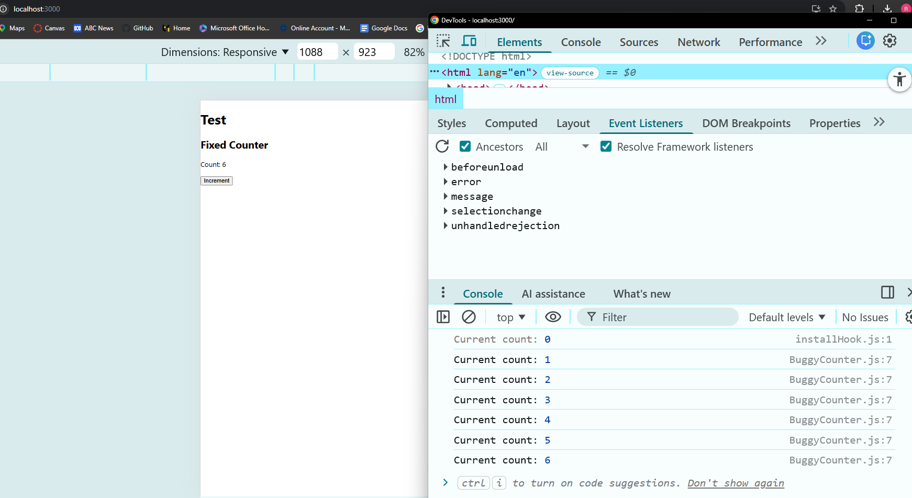

# Debugging Practice

## Article
I reviewed the CSS-Tricks article “Three Buggy React Code Examples and How to Fix Them” and recreated one similar React debugging scenario in my own test project.

## What was the issue?
I created a counter component with a `useEffect` hook that logged the counter value. However, the effect only logged the initial value and did not update when the count changed.

## What debugging method did I use?
I used:
- `console.log()` to inspect the value being logged
- the browser console to compare UI updates with effect behavior
- code inspection to check the dependency array in `useEffect`

## How did I resolve the problem?
I found that the dependency array was empty, so the effect only ran once when the component mounted. I fixed the issue by adding `count` to the dependency array.

## Code Snippet

### Buggy version

```jsx
import { useEffect, useState } from "react";

function BuggyCounter() {
  const [count, setCount] = useState(0);

  useEffect(() => {
    console.log("Current count:", count);
  }, []); // bug: missing dependency

  return (
    <div>
      <h2>Buggy Counter</h2>
      <p>Count: {count}</p>
      <button onClick={() => setCount(count + 1)}>Increment</button>
    </div>
  );
}

export default BuggyCounter;
```


### Fixed version
```jsx
import { useEffect, useState } from "react";

function FixedCounter() {
  const [count, setCount] = useState(0);

  useEffect(() => {
    console.log("Current count:", count);
  }, [count]);

  return (
    <div>
      <h2>Fixed Counter</h2>
      <p>Count: {count}</p>
      <button onClick={() => setCount(count + 1)}>Increment</button>
    </div>
  );
}

export default FixedCounter;
```

