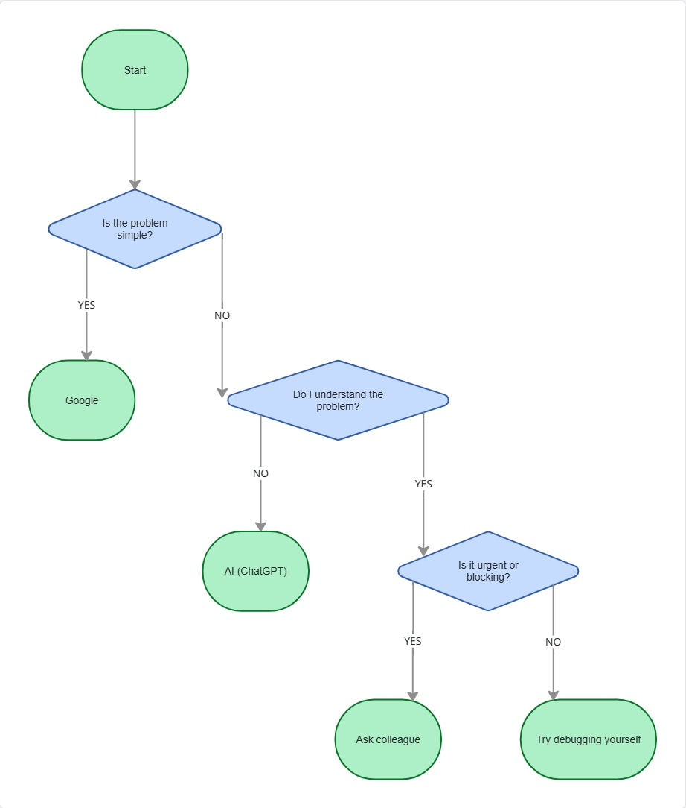

# FlowChart

# Problem-Solving Strategy: Google vs AI vs Asking for Help

## When to Use Google

I prefer using Google when:
- I need quick answers or syntax examples
- The problem is common (e.g., error messages)
- I want official documentation

Google is useful for finding reliable and specific solutions.

---

## When to Use AI Tools

I use AI tools like ChatGPT when:
- I don’t fully understand a concept
- I need explanations or step-by-step guidance
- I want to compare different approaches

AI helps me learn faster and understand problems more deeply.

---

## When to Ask a Colleague

I ask a colleague when:
- I am stuck for a long time (e.g., 30–60 minutes)
- The issue is blocking my progress
- The problem is complex or project-specific

This saves time and avoids frustration.

---

## Factors I Consider

- Complexity of the problem
- Urgency of the task
- Whether the issue involves sensitive or project-specific information

---

## Challenges When Troubleshooting Alone

One challenge is spending too much time on small issues without progress. Another challenge is misunderstanding the problem and going in the wrong direction.

---

## Personal Experience

During this project, I used Google to search for specific errors and documentation. I used AI tools to understand concepts like React hooks and Tailwind CSS setup. When I encountered configuration issues (such as Tailwind version conflicts), AI helped me troubleshoot step by step.

This combination helped me solve problems more efficiently.