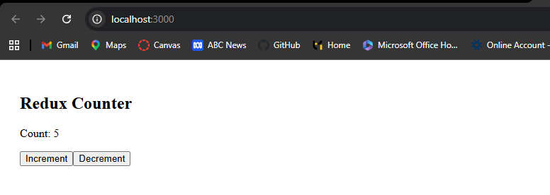
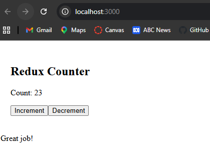

## Redux Reflection

Redux is useful when managing global state across multiple components. Unlike useState, which is limited to a single component, Redux allows centralized state management.

In this task, I created a Redux store and connected it to a counter component using useSelector and useDispatch. This allowed me to manage state globally and update it from any component.

Redux is more useful in larger applications where many components need access to the same state, such as user authentication or shared data.

### References

```js (Counter.js)
import { useSelector, useDispatch } from "react-redux";
import { increment, decrement } from "./counterSlice";

function Counter() {
  const count = useSelector((state) => state.counter.value);
  const dispatch = useDispatch();

  return (
    <div style={{ padding: "20px" }}>
      <h2>Redux Counter</h2>

      <p>Count: {count}</p>

      <button onClick={() => dispatch(increment())}>
        Increment
      </button>

      <button onClick={() => dispatch(decrement())}>
        Decrement
      </button>
    </div>
  );
}

export default Counter;
``` 

```js (counterSlice.js)
import { createSlice } from "@reduxjs/toolkit";

const counterSlice = createSlice({
  name: "counter",
  initialState: {
    value: 0,
  },
  reducers: {
    increment: (state) => {
      state.value += 1;
    },
    decrement: (state) => {
      state.value -= 1;
    },
  },
});

export const { increment, decrement } = counterSlice.actions;
export default counterSlice.reducer;
```

```js (store.js)
import { configureStore } from "@reduxjs/toolkit";
import counterReducer from "./counterSlice";

export const store = configureStore({
  reducer: {
    counter: counterReducer,
  },
});
```



## Redux Selector Reflection

Selectors allow developers to extract specific pieces of state from the Redux store in a reusable way. Instead of directly accessing state using inline functions, selectors improve code readability and maintainability.

In this task, I created a selector function to get the counter value and used it in multiple components. This allowed me to reuse the same logic and keep components clean.

Selectors are especially useful in larger applications where multiple components need access to the same data.

### References

```js (counterSlice.js)
import { createSlice } from "@reduxjs/toolkit";

const counterSlice = createSlice({
  name: "counter",
  initialState: { value: 0 },
  reducers: {
    increment: (state) => {
      state.value += 1;
    },
    decrement: (state) => {
      state.value -= 1;
    },
  },
});

export const { increment, decrement } = counterSlice.actions;
export const selectCount = (state) => state.counter.value;

export default counterSlice.reducer;
```

```js (Counter.js)
import { useSelector, useDispatch } from "react-redux";
import { increment, decrement, selectCount } from "./counterSlice";

function Counter() {
  const count = useSelector(selectCount);
  const dispatch = useDispatch();

  return (
    <div style={{ padding: "20px" }}>
      <h2>Redux Counter</h2>

      <p>Count: {count}</p>

      <button onClick={() => dispatch(increment())}>
        Increment
      </button>

      <button onClick={() => dispatch(decrement())}>
        Decrement
      </button>
    </div>
  );
}

export default Counter;
```

```js (CounterMessage.js)
import { useSelector } from "react-redux";
import { selectCount } from "./counterSlice";

function CounterMessage() {
  const count = useSelector(selectCount);

  let message = "Keep going!";

  if (count > 5) {
    message = "Great job! ";
  } else if (count < 0) {
    message = "Below zero!";
  }

  return <p>{message}</p>;
}

export default CounterMessage;
```

