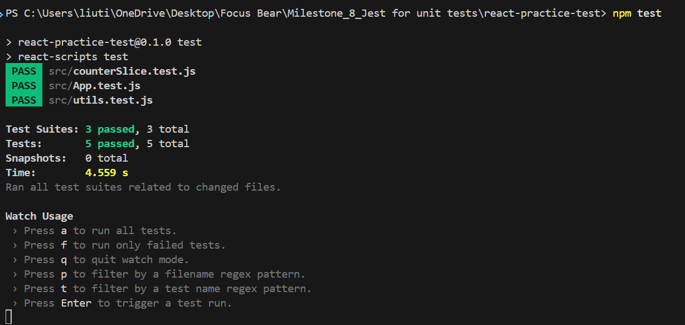
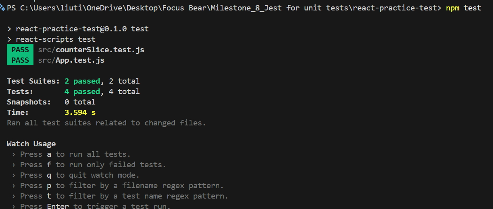
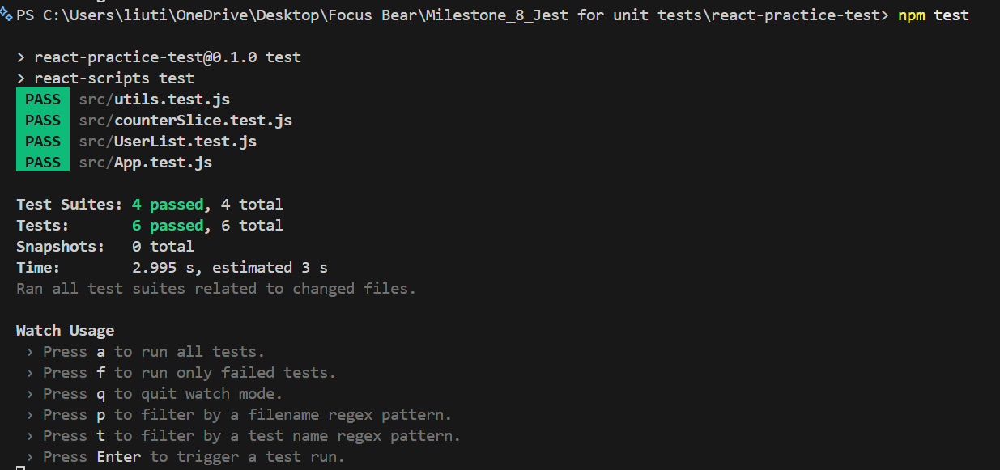
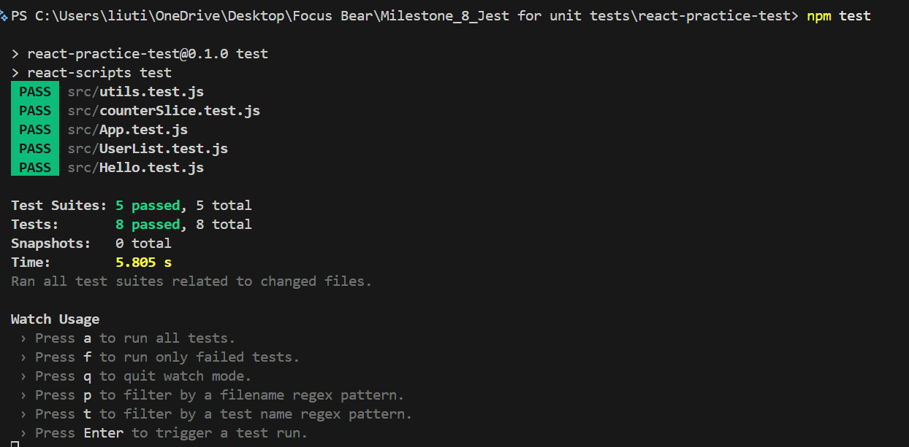

# Unit Testing Reflection

## Why is automated testing important?

Automated testing is important because it ensures that code works correctly and helps prevent bugs when making changes. It allows developers to quickly verify functionality without manually testing everything.

## What was challenging?

The most challenging part was understanding how to structure a test and how Jest works. At first, I was unsure how to import functions and write expectations, but after practicing, it became clearer.

## References

```js (utils.js)
export function add(a, b) {
  return a + b;
}
```

```js (utils.test.js)
import { add } from "./utils";

test("adds two numbers correctly", () => {
  expect(add(2, 3)).toBe(5);
});
```



# Redux Testing Reflection

## Most challenging part

The most challenging part was understanding how to test reducers independently from components. Initially, it was confusing how Redux state updates could be tested without rendering the UI.

## Difference from React component testing

Redux tests focus on logic and state changes, while React component tests focus on UI rendering and user interactions.

In Redux testing, we directly test reducers and actions, whereas in React testing we check how components behave in the browser.

## What I learned

I learned that testing Redux is simpler than expected because reducers are pure functions. This makes it easy to verify state changes by passing actions and checking the output.

## References

```js (counterSlice.test.js)
import counterReducer, { increment, decrement } from "./counterSlice";

describe("counter reducer", () => {
  it("should return the initial state", () => {
    expect(counterReducer(undefined, { type: undefined })).toEqual({
      value: 0,
    });
  });

  it("should handle increment", () => {
    const initialState = { value: 0 };
    const newState = counterReducer(initialState, increment());

    expect(newState.value).toBe(1);
  });

  it("should handle decrement", () => {
    const initialState = { value: 1 };
    const newState = counterReducer(initialState, decrement());

    expect(newState.value).toBe(0);
  });
});
```



# Mocking API Reflection

Mocking API calls is important because it allows tests to run without relying on real network requests. This makes tests faster, more reliable, and independent of external services.

In this task, I used jest.fn() to mock the fetch function and return sample data. This allowed me to test how the component behaves when data is received.

A common challenge when testing asynchronous code is handling timing issues. I used waitFor to ensure the test waits for the data to load before checking the result.

## References

```js (UserList.js)
import { useEffect, useState } from "react";

function UserList() {
  const [users, setUsers] = useState([]);

  useEffect(() => {
    fetch("https://jsonplaceholder.typicode.com/users")
      .then((res) => res.json())
      .then((data) => setUsers(data));
  }, []);

  return (
    <div>
      <h2>Users</h2>
      {users.map((user) => (
        <p key={user.id}>{user.name}</p>
      ))}
    </div>
  );
}

export default UserList;
```

```js (UserList.test.js)
import { render, screen } from "@testing-library/react";
import UserList from "./UserList";

beforeEach(() => {
  global.fetch = jest.fn(() =>
    Promise.resolve({
      json: () =>
        Promise.resolve([
          { id: 1, name: "Alice" },
          { id: 2, name: "Bob" },
        ]),
    })
  );
});

afterEach(() => {
  jest.clearAllMocks();
});

test("renders users from API", async () => {
  render(<UserList />);

  expect(await screen.findByText("Alice")).toBeInTheDocument();
  expect(await screen.findByText("Bob")).toBeInTheDocument();
});
```



# React Testing Library Reflection

React Testing Library focuses on testing how users interact with components rather than testing implementation details. This makes tests more reliable and closer to real user behavior.

In this task, I created a component with a button and tested both the initial render and the interaction using fireEvent. This helped me understand how to simulate user actions in tests.

One challenge was understanding how to select elements and trigger events correctly, but using functions like getByText made it easier.

## References

```js (Hello.js)
import { useState } from "react";

function Hello() {
  const [message, setMessage] = useState("Hello");

  return (
    <div>
      <h1>{message}</h1>
      <button onClick={() => setMessage("Clicked!")}>
        Click Me
      </button>
    </div>
  );
}

export default Hello;
```

```js (Hello.test.js)
import { render, screen, fireEvent } from "@testing-library/react";
import Hello from "./Hello";

test("renders initial message", () => {
  render(<Hello />);
  expect(screen.getByText("Hello")).toBeInTheDocument();
});

test("changes message on button click", () => {
  render(<Hello />);

  const button = screen.getByText("Click Me");
  fireEvent.click(button);

  expect(screen.getByText("Clicked!")).toBeInTheDocument();
});
```

